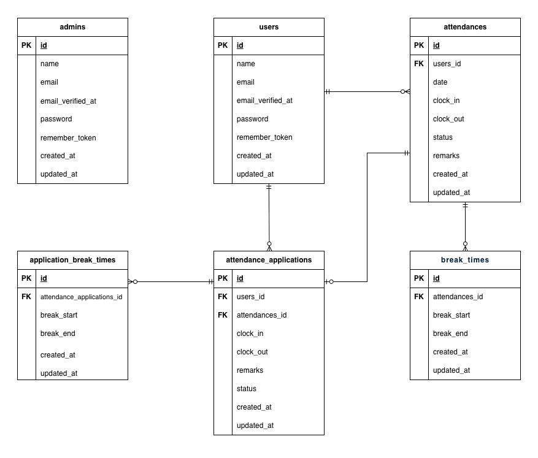

# 勤怠管理アプリ

## 環境構築

**Docker ビルド**

1. リポジトリをクローン

```bash
git clone git@github.com:n-saori-code/attendance-system.git
```

2. DockerDesktop アプリを立ち上げる

3. クローンしたディレクトリ(free-market-app)内に移動し、以下のコマンドで Docker コンテナをビルドして起動

```bash
docker-compose up -d --build
```

> _本プロジェクトでは、**M1/M2 Mac でもビルド可能** になるように `platform: linux/amd64` を指定済みです。_

```bash
# docker-compose.yml
nginx:
    platform: linux/amd64

php:
    platform: linux/amd64

mysql:
    platform: linux/amd64

phpmyadmin:
    platform: linux/amd64

# Dockerfile
FROM --platform=linux/amd64 php:8.1-fpm
```

**Laravel 環境構築**

1. コンテナに入る

```bash
docker-compose exec php bash
```

2. 依存パッケージをインストール

```bash
composer install
```

3. 「.env.example」ファイルを「.env」ファイルにコピーまたはリネーム

```bash
cp .env.example .env
```

4. .env に以下の環境変数を追加

```text
DB_CONNECTION=mysql
DB_HOST=mysql
DB_PORT=3306
DB_DATABASE=laravel_db
DB_USERNAME=laravel_user
DB_PASSWORD=laravel_pass
```

```text
MAIL_MAILER=smtp
MAIL_HOST=mailhog
MAIL_PORT=1025
MAIL_USERNAME=null
MAIL_PASSWORD=null
MAIL_ENCRYPTION=null
MAIL_FROM_ADDRESS=no-reply@example.com
MAIL_FROM_NAME="${APP_NAME}"
```

5. アプリケーションキーの作成

```bash
php artisan key:generate
```

6. マイグレーションの実行

```bash
php artisan migrate
```

7. シーディングの実行

```bash
php artisan db:seed
```

## メール認証機能(使用技術：Mailhog)

1. 会員登録後、メール認証画面に遷移
2. 「認証はこちらから」のボタンを押し、http://localhost:8025 にアクセスし、届いたメールを確認
3. メール内の「Verify Email Address」ボタンをクリック
4. 認証完了後、プロフィール設定画面に遷移

## テストアカウント（シーディングで自動作成）

### 管理者アカウント

- ユーザー名：管理者ユーザー
- メールアドレス：admin@example.com
- パスワード：adminpassword

### 一般ユーザーアカウント

- ユーザー名：西 伶奈
- メールアドレス：reina.n@coachtech.com
- パスワード：password001

- ユーザー名：山田 太郎
- メールアドレス：taro.y@coachtech.com
- パスワード：password002

- ユーザー名：増田 一世
- メールアドレス：issei.m@coachtech.com
- パスワード：password003

- ユーザー名：山本 敬吉
- メールアドレス：keikichi.y@coachtech.com
- パスワード：password004

- ユーザー名：秋田 朋美
- メールアドレス：tomomi.a@coachtech.com
- パスワード：password005

- ユーザー名：中西 教夫
- メールアドレス：norio.n@coachtech.com
- パスワード：password006

## テーブル仕様

### users テーブル

| カラム名          | 型              | primary key | unique key | not null | foreign key |
| ----------------- | --------------- | ----------- | ---------- | -------- | ----------- |
| id                | unsigned bigint | ◯           |            | ◯        |             |
| name              | varchar(255)    |             |            | ◯        |             |
| email             | varchar(255)    |             | ◯          | ◯        |             |
| email_verified_at | timestamp       |             |            |          |             |
| password          | varchar(255)    |             |            | ◯        |             |
| remember_token    | varchar(100)    |             |            |          |             |
| created_at        | timestamp       |             |            |          |             |
| updated_at        | timestamp       |             |            |          |             |

### attendances テーブル

| カラム名   | 型              | primary key | unique key | not null | foreign key |
| ---------- | --------------- | ----------- | ---------- | -------- | ----------- |
| id         | unsigned bigint | ◯           |            | ◯        |             |
| user_id    | unsigned bigint |             |            | ◯        | users(id)   |
| date       | date            |             |            | ◯        |             |
| clock_in   | datetime        |             |            |          |             |
| clock_out  | datetime        |             |            |          |             |
| status     | varchar(50)     |             |            | ◯        |             |
| remarks    | text            |             |            |          |             |
| created_at | timestamp       |             |            |          |             |
| updated_at | timestamp       |             |            |          |             |

### break_times テーブル

| カラム名      | 型              | primary key | unique key | not null | foreign key     |
| ------------- | --------------- | ----------- | ---------- | -------- | --------------- |
| id            | unsigned bigint | ◯           |            | ◯        |                 |
| attendance_id | unsigned bigint |             |            | ◯        | attendances(id) |
| break_start   | datetime        |             |            | ◯        |                 |
| break_end     | datetime        |             |            |          |                 |
| created_at    | timestamp       |             |            |          |                 |
| updated_at    | timestamp       |             |            |          |                 |

### attendance_applications テーブル

| カラム名      | 型              | primary key | unique key | not null | foreign key     |
| ------------- | --------------- | ----------- | ---------- | -------- | --------------- |
| id            | unsigned bigint | ◯           |            | ◯        |                 |
| user_id       | unsigned bigint |             |            | ◯        | users(id)       |
| attendance_id | unsigned bigint |             |            | ◯        | attendances(id) |
| clock_in      | time            |             |            |          |                 |
| clock_out     | time            |             |            |          |                 |
| remarks       | text            |             |            |          |                 |
| status        | varchar(50)     |             |            | ◯        |                 |
| created_at    | timestamp       |             |            |          |                 |
| updated_at    | timestamp       |             |            |          |                 |

### application_break_times テーブル

| カラム名                  | 型              | primary key | unique key | not null | foreign key                 |
| ------------------------- | --------------- | ----------- | ---------- | -------- | --------------------------- |
| id                        | unsigned bigint | ◯           |            | ◯        |                             |
| attendance_application_id | unsigned bigint |             |            | ◯        | attendance_applications(id) |
| break_start               | time            |             |            | ◯        |                             |
| break_end                 | time            |             |            |          |                             |
| created_at                | timestamp       |             |            |          |                             |
| updated_at                | timestamp       |             |            |          |                             |

### admins テーブル

| カラム名          | 型              | primary key | unique key | not null | foreign key |
| ----------------- | --------------- | ----------- | ---------- | -------- | ----------- |
| id                | unsigned bigint | ◯           |            | ◯        |             |
| name              | varchar(255)    |             |            | ◯        |             |
| email             | varchar(255)    |             | ◯          | ◯        |             |
| email_verified_at | timestamp       |             |            |          |             |
| password          | varchar(255)    |             |            | ◯        |             |
| remember_token    | varchar(100)    |             |            |          |             |
| created_at        | timestamp       |             |            |          |             |
| updated_at        | timestamp       |             |            |          |             |

## テスト環境（PHPUnit）

テストは 開発用 DB に影響を与えない専用データベース demo_test を使用します。

1. テスト用データベースの作成<br>
   Docker 起動直後でまだ demo_test が存在しない場合は、以下の手順で作成してください：<br>
   パスワードは、docker-compose.yml ファイルの MYSQL_ROOT_PASSWORD:を参照。

### データベースの確認

```bash
docker exec -it free-market-app-mysql-1 mysql -u root -p
SHOW DATABASES;
```

### データベースの作成

```bash
docker exec -it free-market-app-mysql-1 bash
mysql -u root -p
CREATE DATABASE demo_test;
exit
```

> \_すでに存在する場合は、この手順は不要です。

2. config ファイルの変更<br>
   database.php を開き、以下の設定になっていることを確認してください。

```bash
'mysql' => [
    'driver' => 'mysql',
    'url' => env('DB_URL'),
    'host' => env('DB_HOST', '127.0.0.1'),
    'port' => env('DB_PORT', '3306'),
    'database' => env('DB_DATABASE', 'laravel'),
    'username' => env('DB_USERNAME', 'root'),
    'password' => env('DB_PASSWORD', ''),
    'unix_socket' => env('DB_SOCKET', ''),
    'charset' => env('DB_CHARSET', 'utf8mb4'),
    'collation' => env('DB_COLLATION', 'utf8mb4_unicode_ci'),
    'prefix' => '',
    'prefix_indexes' => true,
    'strict' => true,
    'engine' => null,
    'options' => extension_loaded('pdo_mysql') ? array_filter([
        PDO::MYSQL_ATTR_SSL_CA => env('MYSQL_ATTR_SSL_CA'),
    ]) : [],
],
```

3. .env.testing ファイルの文頭部分にある APP_ENV と APP_KEY を編集します。<br>
   またデータベースの接続情報を加えてください。

```bash
APP_ENV=test
APP_KEY=
```

```bash
DB_CONNECTION=mysql_test
DB_DATABASE=demo_test
DB_USERNAME=root
DB_PASSWORD=root
```

4. テスト用アプリケーションキーの生成<br>
   テスト実行時に必要なアプリケーションキーを生成します。

```bash
docker-compose exec php bash
php artisan key:generate --env=testing
```

以下でキャッシュをクリアにしてください。

```bash
php artisan config:clear
```

5. マイグレーションコマンドを実行して、テスト用のテーブルを作成します。

```bash
php artisan migrate --env=testing
```

6. phpunit.xml を開き、DB_CONNECTION と DB_DATABASE が以下になっているか確認してください。

```bash
<env name="DB_CONNECTION" value="mysql_test"/>
<env name="DB_DATABASE" value="demo_test"/>
```

7.  PHPUnit テストの実行<br>
    本番・開発用データベースには影響しません。<br>
    以下のコマンドを入力してください。<br>

```bash
# キャッシュをクリアにする
php artisan config:clear
```

```bash
# 個別テストファイルの実行
vendor/bin/phpunit tests/Feature/AuthTest.php
vendor/bin/phpunit tests/Feature/AttendanceTest.php
vendor/bin/phpunit tests/Feature/ApplicationTest.php
vendor/bin/phpunit tests/Feature/AdminTest.php

# ディレクトリ単位でまとめて実行
vendor/bin/phpunit tests/Feature
```

## 使用技術(実行環境)

- PHP 8.4.8
- Laravel 12.35.1
- MySQL8.0.26
- nginx1.21.1

## ER 図



## URL

- 開発環境：http://localhost/
- ユーザー登録：http://localhost/register
- 管理者ログイン：http://localhost/admin/login
- phpMyAdmin：http://localhost:8080/
- Mailhog：http://localhost:8025
